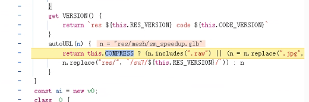

加载器强制按 arraybuffer 读取,
解析器跳过标准 GLB 头部校验，直接解析自定义结构

而是校验自定义头部（ma /nr）
转码生成的私有格式
模型数据已经被预序列化 / 预构建
.bin 存的不是 glTF，而是：
序列化后的 BufferGeometry 数据
完全跳过了 glTF 解析流程

所有数据贴图（法线、粗糙、金属、AO）
encoding:3000 → 删除这行 或 写 LinearColorSpace
所有颜色贴图（baseColor、map、diffuse）
encoding:3001 → 必须改成 SRGBColorSpace

// 开启报错
for (let material of Object.values(this.\_node.userData.meshData.materials)) {
if (material instanceof THREE.MeshStandardMaterial) {
// 启 USE_BOX_PROJECTION 宏
material.defines!.USE_BOX_PROJECTION = '';
}
}
